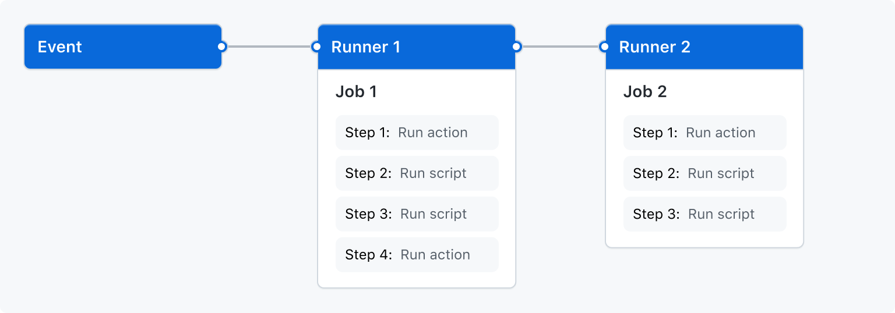
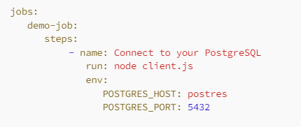
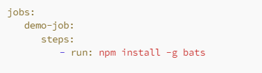
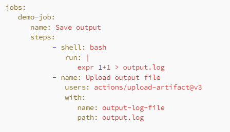

# Introdução

O GitHub a um bom tempo tem sido popularmente a maior ferramenta de hospedagem de código gratuita na internet. Uma feature muito interessante é o GitHub Actions, permitindo automatizar fluxos de build e deploy sem a necessidade de integração com outras plataformas (Azure DevOps, Jenkins, CircleCI).

Outro ponto é a capacidade de usar os próprios agentes do GitHub, eliminando a necessidade de criar ambientes personalizados para executar nossos fluxos de CI/CD. Isso acelera a configuração e execução dos workflows, além de reduzir os custos de implantação, já que a infraestrutura necessária está pronta para uso.

## GitHub Actions: O que é?

***GitHub Actions*** é uma plataforma de integração contínua e entrega contínua (CI/CD), com isso você é capaz de automatizar e executar fluxos de desenvolvimento diretamente do GitHub, enquanto reduz a intervenção manual.

Embora amplamente conhecido como uma ferramenta de DevOps, o ***GitHub Actions*** vai muito além disso. A plataforma permite você personalize e execute diversos outros fluxos quando outros eventos ocorrem no repositório. Por exemplo, é possível realizar um procedimento automatizado para incluir as etiquetas adequadas toda vez que alguém gera uma nova ***Issue*** no repositório.

GitHub Actions funciona com inúmeras linguagens e frameworks e é configurado via YAML, garantindo assim que você possa compartilhá-los facilmente.

### Componentes do GitHub Actions

Como trata-se de uma plataforma de CI/CD, a mesma é formada por alguns componentes descritos na documentação, sendo eles:

 - **Workflow**: É onde vamos descrever todo o processo de automação para podermos compilar, testar e fazer deploy do nosso sistema;
 - **Events**: É uma atividade em particular que desencadeia um Workflow. Pode ser um push, uma PR ou até mesmo uma nova issue;
 - **Jobs**: Job é a etapa que compõem um Workflow. Eles são executadas em um mesmo Runner;
 - **Action**:  É um comando personalizado de como executar uma tarefa complexa, mas frequentemente repetitiva, automatizando assim um fluxo de trabalho;
 - **Runner**: É a máquina responsável por executar o workflow e as actions e nos prover o feedback do nosso processo. Os runners podem ser hospedados pelo GitHub (runners hospedados) ou configurados e mantidos por você (runners auto-hospedados);

### Features que precisamos da plataforma:

Nos próximos tópicos vamos listar algumas features que são essenciais para automação do fluxo de integração e entrega contínua, presente no GitHub Actions.

### Variáveis em Workflows

Existem variáveis de ambiente padrões do GitHub, que são lidas automaticamente em cada WorkFlow. Um exemplo disto é a variável GITHUB_TOKEN, que trata-se de um token de acesso de autenticação de curta duração que permite que o workflow interaja com o repositório atual e outros repositórios no GitHub durante a execução (checkouts, criar issues, pushes, etc).

No entanto também é possível personalizar variáveis ambiente diretamente nos arquivos YAML.

### Adição de Scripts ao Workflow

GitHub Actions permitem a adição de scripts ao fluxo de trabalho. Você pode empregar ações para executar scripts e comandos shell.

### Compartilhando informações entre Jobs

Outra feature que pode facilitar muito o processo de automação encotrada em outras plataformas, a possibilidade de compartilhar artefatos entre jobs diferentes, também encontra-se presente por aqui:

Na imagem acima, este job do GitHub Actions calcula a expressão matemática 1+1, armazena o resultado no arquivo output.log e, em seguida, faz o upload deste arquivo como um artefato do workflow
________________________________

### Criando nossa primeira pipeline no GitHub Actions

Lorem Ipsum is simply dummy text of the printing and typesetting industry.

### Iniciando configurações

### Rodando os arquivos

________
### Repositórios Relacionados

Dois mini projetos foram criados para simular o fluxo de desenvolvimento e testar o uso das actions:

 - [Frontend Angular](https://github.com/biduco07/IFMT-Devops-AOMS);
 - [Backend NestJs](https://github.com/tonkunz/ifmt-articles-api);

### Ferramentas Utilizadas

 - [Angular](https://angular.dev/);
 - [NestJs](https://nestjs.com/);
 - [Heroku](https://dashboard.heroku.com/);
 - [Railway](https://railway.app/);
 - [Prisma](https://www.prisma.io/);

 ### Membros da atividade

- André Luiz Rabello da Silva;
- Everton Henrique Oliveira Kunz;
- João André Ferreira de Almeida;
- Pedro Henrique Veloso de Melo;
- Thiago Nascimento da Silva;